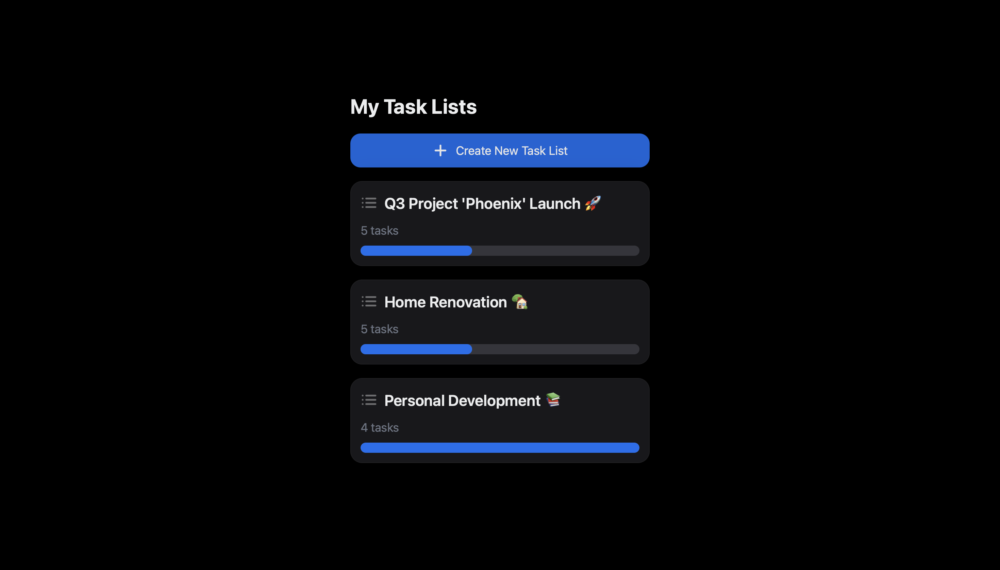
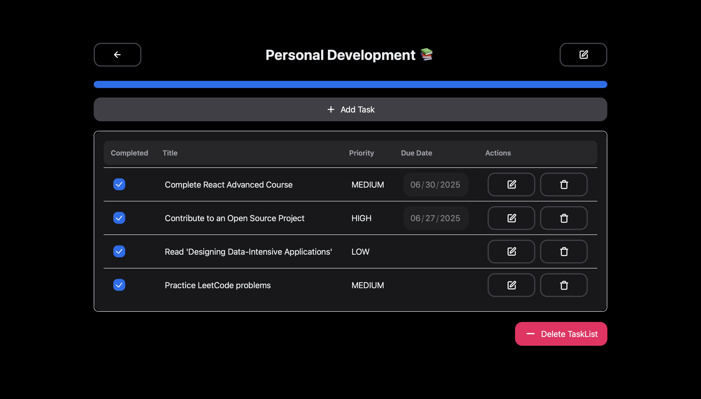
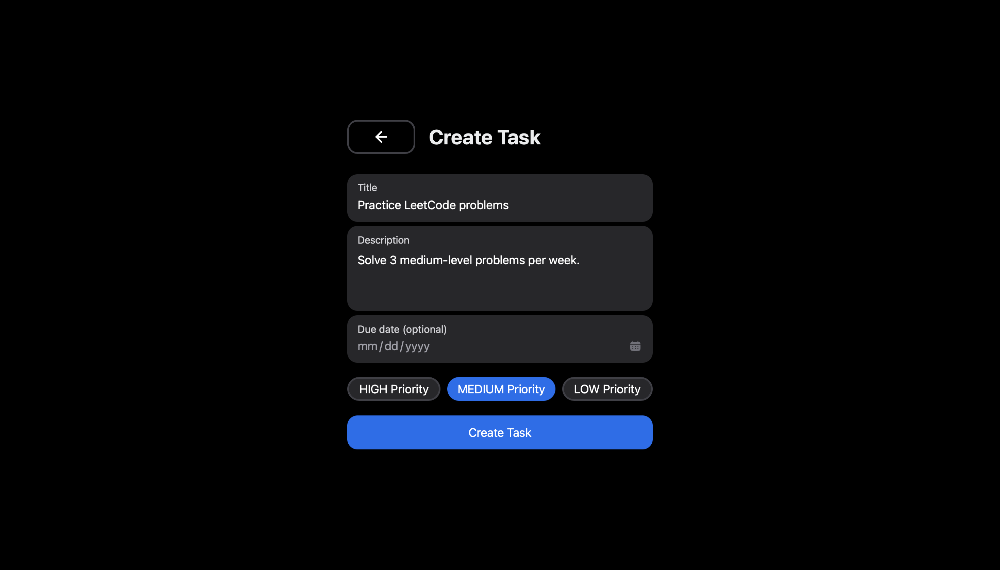

# Tasky: Full-Stack Task Management Application


Tasky is a modern, full-stack task management application designed to help you organize your to-do items efficiently. Create distinct task lists, manage individual tasks within them, and track your progress with a clean and intuitive user interface.

## Table of Contents
- [Demo](#demo)
- [Features](#features)
- [Technology Stack](#technology-stack)
- [Project Structure](#project-structure)
- [Setup and Installation](#setup-and-installation)
- [API Endpoints](#api-endpoints)
- [Contributing](#contributing)
- [License](#license)

## Demo

Here's a glimpse of what Tasky looks like in action.

**Task Lists Dashboard:** The main screen where all your task lists are displayed.
**

**Individual Task List View:** A detailed view of a single task list, showing its tasks, progress, and actions.
**

**Create/Update Task Form:** A modal or screen for adding new tasks or editing existing ones.
**

## Features

- **Task List Management:**
  - **CRUD Operations:** Create, Read, Update, and Delete task lists.
  - **Centralized Dashboard:** View all task lists at a glance.
  - **Progress Tracking:** Each list displays a progress bar based on the completion status of its tasks.
  - **Task Count:** See the total number of tasks in each list.

- **Task Management:**
  - **CRUD Operations:** Add, update, and delete tasks within a specific list.
  - **Detailed Tasks:** Assign a title, description, due date, and priority (`High`, `Medium`, `Low`).
  - **Status Toggling:** Easily mark tasks as `Open` or `Closed` with a single click.

- **User Experience:**
  - **Modern UI:** A clean, responsive, and aesthetically pleasing interface built with NextUI and Tailwind CSS.
  - **Seamless Navigation:** Fast and logical routing powered by React Router.
  - **Reliable State Management:** Centralized state using React Context API ensures UI consistency and predictability.

## Technology Stack

The project is built using a modern, robust technology stack, separated into a backend service and a frontend application.

### Backend (Spring Boot)
- **Framework:** Spring Boot 3.5.0
- **Language:** Java 21
- **Data Persistence:** Spring Data JPA / Hibernate
- **Database:**
  - **Production/Development:** PostgreSQL
  - **Testing:** H2 In-Memory Database
- **API:** RESTful API with Spring Web
- **Build Tool:** Maven

### Frontend (React)
- **Framework/Library:** React 18 with TypeScript
- **Build Tool:** Vite
- **UI:** NextUI & Tailwind CSS
- **Routing:** React Router 6
- **State Management:** React Context API with `useReducer` hook
- **HTTP Client:** Axios

## Project Structure

The repository is organized into two main directories: `task-be` for the backend and `task-fe` for the frontend.

```
.
├── task-be/                  # Spring Boot Backend
│   ├── pom.xml
│   └── src/
│       └── main/
│           ├── java/com/prp/tasks/
│           │   ├── controllers/    # API Controllers
│           │   ├── domain/         # DTOs, Entities, Enums
│           │   ├── mappers/        # DTO-Entity Mappers
│           │   ├── repository/     # Spring Data JPA Repositories
│           │   └── services/       # Business Logic
│           └── resources/
│               └── application.properties
│
└── task-fe/                  # React Frontend
    ├── package.json
    ├── vite.config.ts        # Vite configuration with API proxy
    └── src/
        ├── assets/
        ├── components/       # React Components (Screens)
        ├── domain/           # TypeScript types and enums
        ├── App.tsx           # Main application router
        ├── AppProvider.tsx   # Global state and API logic (Context)
        └── main.tsx          # Application entry point
```

## Setup and Installation

Follow these steps to get the application running on your local machine.

### Prerequisites
- Java JDK 21
- Apache Maven
- Node.js (v18 or later) & npm
- A running PostgreSQL instance

### 1. Backend Setup (`task-be`)

1.  **Configure Database:**
    - Navigate to `task-be/src/main/resources/application.properties`.
    - Create a database in your PostgreSQL instance (e.g., `postgres`).
    - Update the `spring.datasource.url`, `spring.datasource.username`, and `spring.datasource.password` properties to match your PostgreSQL configuration.

    ```properties
    spring.datasource.url=jdbc:postgresql://localhost:5432/your_database_name
    spring.datasource.username=your_postgres_user
    spring.datasource.password=your_postgres_password
    ```

2.  **Run the Backend:**
    - Open a terminal in the `task-be` directory.
    - Run the application using Maven:
      ```bash
      mvn spring-boot:run
      ```
    - The backend server will start on `http://localhost:8080`.

### 2. Frontend Setup (`task-fe`)

1.  **Configure API Proxy:**
    - To avoid CORS issues during development, the frontend needs to proxy API requests to the backend.
    - Create a file named `vite.config.ts` in the `task-fe` directory.
    - Add the following configuration:

    ```typescript
    // task-fe/vite.config.ts
    import { defineConfig } from 'vite'
    import react from '@vitejs/plugin-react'

    // https://vitejs.dev/config/
    export default defineConfig({
      plugins: [react()],
      server: {
        proxy: {
          '/api': {
            target: 'http://localhost:8080', // Spring Boot backend URL
            changeOrigin: true,
            secure: false,
          },
        },
      },
    })
    ```

2.  **Install Dependencies and Run:**
    - Open a separate terminal in the `task-fe` directory.
    - Install the required npm packages:
      ```bash
      npm install
      ```
    - Start the development server:
      ```bash
      npm run dev
      ```
    - The frontend application will be available at `http://localhost:5173`.

You can now access Tasky in your browser!

## API Endpoints

The backend provides the following RESTful API endpoints.

### Task List Endpoints
| Method | Path                  | Description                     |
| :----- | :-------------------- | :------------------------------ |
| `GET`  | `/api/task-lists`       | Get all task lists              |
| `POST` | `/api/task-lists`       | Create a new task list          |
| `GET`  | `/api/task-lists/{id}`  | Get a single task list by ID    |
| `PUT`  | `/api/task-lists/{id}`  | Update an existing task list    |
| `DELETE`| `/api/task-lists/{id}`  | Delete a task list and its tasks|

### Task Endpoints
| Method | Path                                   | Description                    |
| :----- | :------------------------------------- | :----------------------------- |
| `GET`  | `/api/task-lists/{listId}/tasks`         | Get all tasks for a list       |
| `POST` | `/api/task-lists/{listId}/tasks`         | Create a new task in a list    |
| `GET`  | `/api/task-lists/{listId}/tasks/{taskId}`| Get a single task by ID        |
| `PUT`  | `/api/task-lists/{listId}/tasks/{taskId}`| Update an existing task        |
| `DELETE`| `/api/task-lists/{listId}/tasks/{taskId}`| Delete a task                  |

## Contributing

Contributions are what make the open-source community such an amazing place to learn, inspire, and create. Any contributions you make are **greatly appreciated**.

1.  Fork the Project
2.  Create your Feature Branch (`git checkout -b feature/AmazingFeature`)
3.  Commit your Changes (`git commit -m 'Add some AmazingFeature'`)
4.  Push to the Branch (`git push origin feature/AmazingFeature`)
5.  Open a Pull Request

## License

This project is distributed under the MIT License. See `LICENSE` for more information.